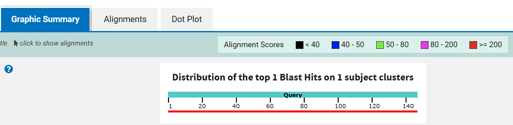
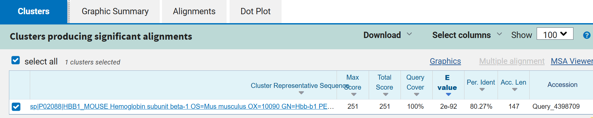
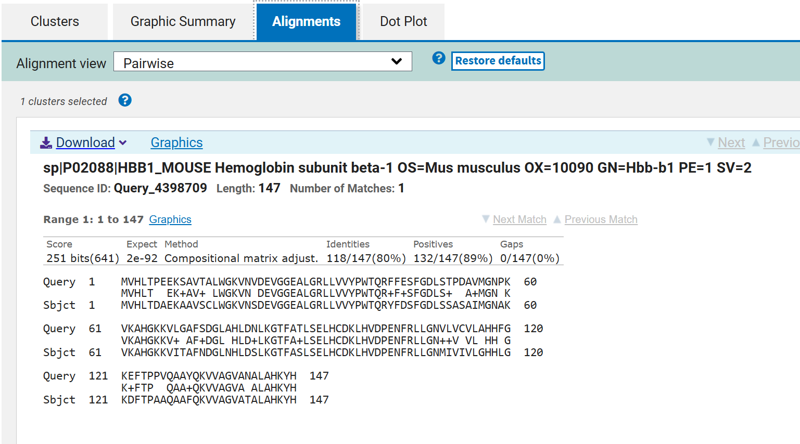

# Comparative BLAST Analysis of Human and Mouse Hemoglobin Beta


## Overview

This project presents a pairwise protein sequence comparison of human
and mouse hemoglobin beta subunits using NCBI BLASTp. The analysis
evaluates sequence identity, amino acid similarity, alignment coverage,
statistical significance, and the evolutionary conservation of
hemoglobin beta proteins between the two organisms.

---

## Objective

To compare homologous hemoglobin beta protein sequences from human
and mouse and interpret the biological significance of their sequence
similarity using NCBI BLASTp.

---

## Sequence Data

| Organism | Protein | Gene | UniProtKB Accession | Length |
|---|---|---|---|---:|
| *Homo sapiens* | Hemoglobin subunit beta | HBB | P68871 | 147 aa |
| *Mus musculus* | Hemoglobin subunit beta-1 | Hbb-b1 | P02088 | 147 aa |

Sequences are available in the [`sequences/`](sequences/) directory.

---

## Methodology

1. Reviewed protein sequences were obtained from UniProtKB/Swiss-Prot
2. Human HBB (P68871) was used as the query sequence
3. Mouse Hbb-b1 (P02088) was used as the subject sequence
4. Pairwise alignment was performed using NCBI BLASTp
5. Alignment statistics were recorded and interpreted
6. Results were documented with biological context

### BLAST Configuration

| Parameter | Value |
|---|---|
| **Program** | BLASTp |
| **Mode** | Pairwise sequence alignment |
| **Query** | Human HBB — P68871 |
| **Subject** | Mouse Hbb-b1 — P02088 |
| **Scoring Method** | Compositional matrix adjustment |
| **RID** | 5KZFRGG8114 |

---

## Results

| Metric | Result |
|---|---|
| **Bit Score** | 251 bits (641) |
| **E-value** | 2e-92 |
| **Query Cover** | 100% |
| **Identities** | 118/147 (80%) |
| **Positives** | 132/147 (89%) |
| **Gaps** | 0/147 (0%) |

The complete BLAST output is available in
[`results/BLAST-output.txt`](results/BLAST-output.txt)

---

## Result Screenshots

### Graphical Summary


### Alignment Statistics


### Pairwise Alignment


---

## Biological Interpretation

The pairwise BLASTp alignment demonstrates strong sequence conservation
between human and mouse hemoglobin beta proteins:

- **80% identity** — 118 out of 147 positions are perfectly identical
- **89% similarity** — 132 positions share identical or biochemically
  similar amino acids
- **Zero gaps** — both proteins are exactly 147 amino acids with no
  insertions or deletions, confirming preserved sequence length
- **E-value of 2e-92** — the probability of this alignment occurring
  by chance is essentially zero, confirming biological significance
- **100% query coverage** — the entire human sequence aligns to mouse
  with no unaligned regions

These findings are consistent with the conserved role of hemoglobin
beta subunits in oxygen transport across mammalian species.

---

## Repository Structure

```text
BLAST-Sequence-Analysis/
├── README.md
├── LICENSE
├── sequences/
│   ├── human hbb.fasta.txt
│   └── mouse hbb.fasta.txt
├── results/
│   ├── README.md
│   └── BLAST-output.txt
├── screenshots/
│   ├── README.md
│   ├── 01-BLAST-graphical-summary.png
│   ├── 02-BLAST-alignment-statistics.png
│   └── 03-BLAST-pairwise-alignment.png
├── report/
│   ├── README.md
│   ├── BLAST_Interpretation.md
│   └── Lessons_Learned.md
└── references/
    ├── README.md
    └── References.md
    Reproducibility
To reproduce this analysis:

Open NCBI Protein BLAST
Paste the human HBB FASTA sequence into the query field
Select Align two or more sequences
Paste the mouse Hbb-b1 FASTA sequence into the subject field
Select BLASTp with compositional matrix adjustment
Run the analysis and record the displayed statistics
Download the result in text format
Project Documentation
Document	Description
report/BLAST_Interpretation.md	Detailed interpretation of BLAST results
report/Lessons_Learned.md	Reflection on skills and concepts learned
references/References.md	All citations and data sources
results/BLAST-output.txt	Raw BLAST output file
Skills Demonstrated
Protein sequence retrieval from UniProtKB
FASTA format handling
Pairwise sequence alignment using NCBI BLASTp
Interpretation of bit scores and E-values
Analysis of identity, positives, and gaps
Scientific result documentation
Professional repository organization
Git and GitHub project management
Limitations and Future Work
This project compares only two protein sequences. Future work could include:

Multiple sequence alignment of beta-globin proteins
Phylogenetic tree construction across mammalian species
Protein structure comparison using PDB
Analysis of conserved functional residues
Automated BLAST analysis using BLAST+ or Biopython
References
Full citations are listed in references/References.md

Key sources:

UniProtKB P68871 — Human HBB
UniProtKB P02088 — Mouse Hbb-b1
Altschul et al. (1990) — Original BLAST paper
Altschul et al. (1997) — Gapped BLAST paper
License
This project is distributed under the MIT License

Author
Esha Tahir Undergraduate Bioinformatics Student

Developing practical skills in sequence analysis, biological databases, scientific documentation, and reproducible computational research.
